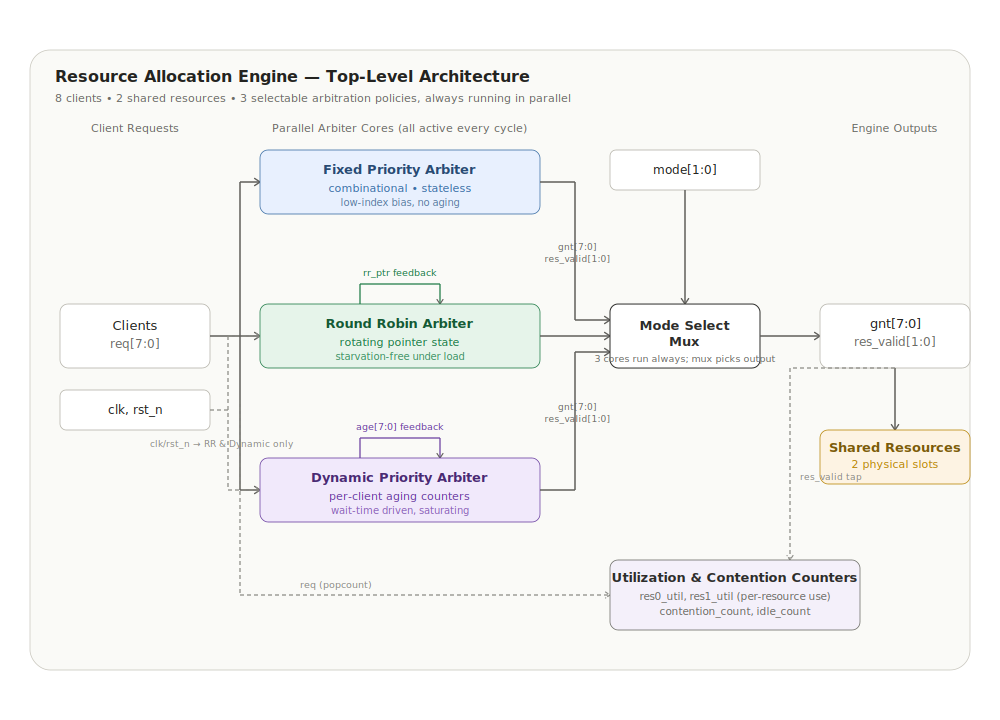
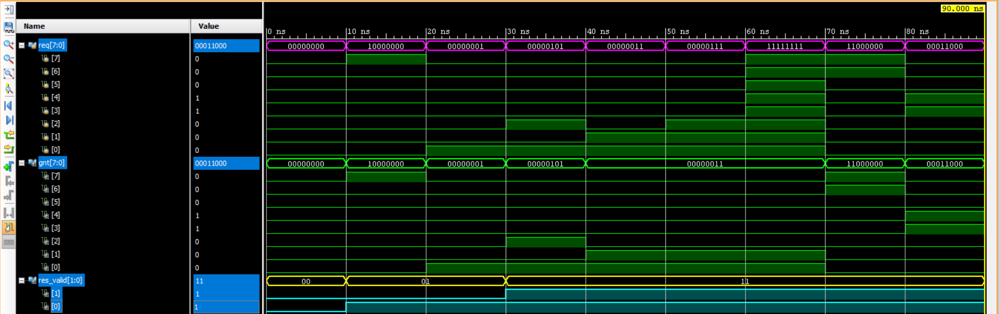
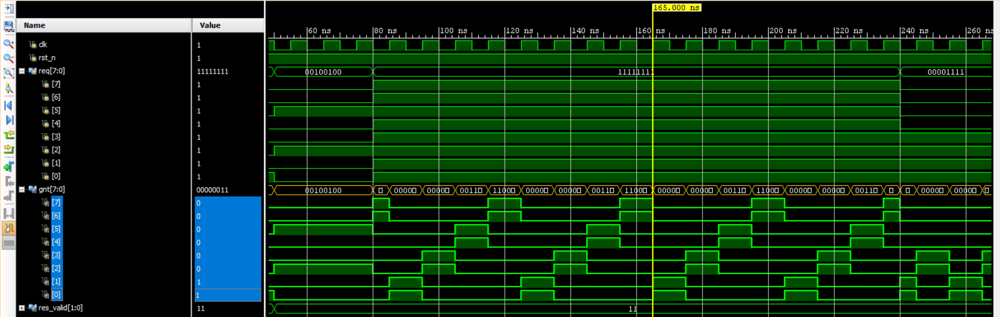
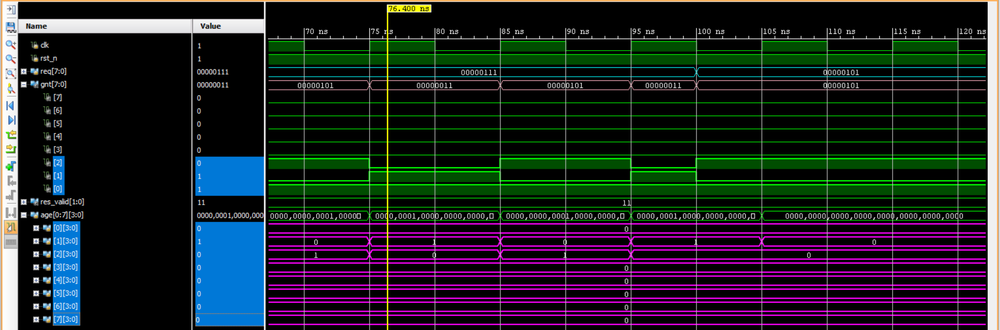
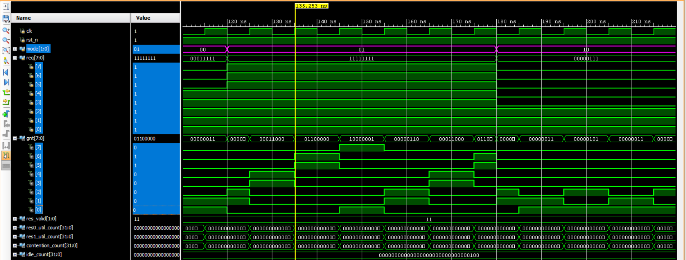
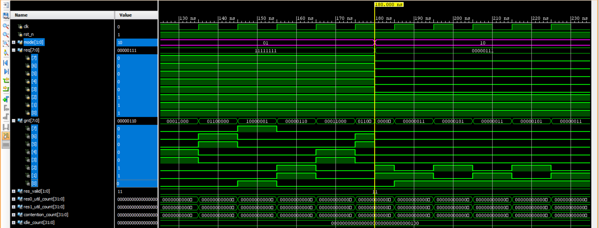

# Multi-Client Arbitration and Resource Allocation Engine

This project implements a configurable, parameterizable shared-resource allocation engine in synthesizable Verilog HDL. The design supports concurrent access requests from 8 independent clients competing for 2 shared hardware resources, and integrates three distinct arbitration policies — Fixed Priority, Round Robin, and Dynamic Priority (Aging-Based) — behind a single runtime-selectable interface.



---

## Project Overview

In multi-master SoC interconnects, functional blocks frequently compete for a limited pool of shared resources — buses, memory ports, or accelerator lanes. Without an organized scheduling layer, this leads to unpredictable latency and unfair access distribution.

This project models that problem directly: 8 client channels contend for 2 shared resource slots, arbitrated by one of three interchangeable policies. Each policy makes a different trade-off between logic simplicity, fairness, and starvation resistance, and all three are integrated behind one interface so the active policy can be changed at runtime via a `mode[1:0]` control input.

---

## Key Highlights

- Configurable engine supporting 8 clients contending for 2 shared resources.
- Three arbitration policies — Fixed Priority, Round Robin, and Dynamic Priority (Aging) — integrated behind one unified interface.
- Runtime mode switching (`mode[1:0]`) with no reset of arbitration state: all three cores run continuously in parallel, so each policy's internal fairness history (rotation pointer, age counters) is preserved even while not selected.
- Live hardware counters for per-resource utilization, contention, and idle cycles, verified directly against simulation.
- Directed verification across single-request, multi-client contention, full 8-client persistent-contention, and mode-switching scenarios.
- Synthesizable Verilog HDL (IEEE 1364-2001 style), structured for the Vivado 2014.1 RTL/simulation/synthesis flow.
- Timing-driven RTL rework: the Dynamic Priority arbiter's winner-selection logic was restructured from a linear 8-stage comparator chain into a balanced tournament-tree comparator to reduce critical-path depth.

---

## Implemented Arbitration Strategies

### Fixed Priority Arbitration
A purely combinational, stateless design. Requests are resolved by a cascaded priority-encoder structure with Client 0 as highest priority and Client 7 as lowest. Lowest propagation delay of the three, but low-priority (high-index) clients can be starved indefinitely under sustained contention from higher-priority clients.

### Round Robin Arbitration
Adds a single rotating pointer register (`rr_ptr`) that advances past the highest-index client serviced each cycle. Requests are rotated into the pointer's reference frame, arbitrated with the same encoder structure as Fixed Priority, then rotated back. Verified starvation-free: under full 8-client persistent contention, every client is serviced in a stable, repeating rotation.

### Dynamic Priority (Aging-Based) Arbitration
Each client has a saturating age counter that increments while it requests but isn't granted, and resets to zero the instant it's granted (or if it stops requesting). The arbiter grants the highest-age requester(s) each cycle, tie-broken by lowest client index. Winner selection was originally implemented as a linear left-to-right scan; this was later restructured into a balanced tournament tree (pairwise comparison, 8→4→2→1) to cut the critical-path depth from ~8 sequential comparisons per resource to ~3.

### Strategy Comparison

| Strategy | Priority Mechanism | Fairness | Starvation Risk | Relative Complexity |
|---|---|---|---|---|
| **Fixed Priority** | Static index order | Poor for high-index clients | High | Very low (encoder only) |
| **Round Robin** | Rotating pointer | Excellent, verified period-4 rotation under full contention | None | Moderate (1 pointer register) |
| **Dynamic Priority (Aging)** | Per-client wait-time counters | Good, bounded wait even for low-index-disadvantaged clients | None | Higher (per-client counters + tree comparator) |

---

## Design Flow

```text
RTL Design
     │
     ▼
Testbench Development
     │
     ▼
Vivado Simulation (XSim)
     │
     ▼
Waveform Debugging
     │
     ▼
Synthesis
     │
     ▼
Implementation
     │
     ▼
Timing Analysis
     │
     ▼
Utilization Reporting
```

---

## Simulation Results

### Fixed Priority Arbiter
Directed test sweep across idle, single-client, multi-client, and full 8-client contention cases, confirming clients 2–7 receive zero grants under sustained full-load contention.



### Round Robin Arbiter
Persistent 8-client contention showing the pointer-driven rotation servicing all 8 clients in a repeating period, plus a per-client grant-count fairness tally.



### Dynamic Priority (Aging) Arbiter
Per-client age counters tracked across a 3-client contention scenario, showing the characteristic sawtooth aging pattern and grant-on-saturation behavior.



### Resource Allocation Engine — Persistent Contention
Full engine under all-8-client persistent contention with live utilization/contention counters tracked alongside grant activity.



### Runtime Arbitration Mode Switching
`mode[1:0]` changed mid-simulation while requests remain active, confirming the output immediately reflects the newly selected policy with no dropped cycles or invalid grant states.



---

## Functional Verification Results

The following counter values were captured directly from the Resource Allocation Engine testbench, covering idle, single-client, multi-client, full 8-client persistent contention, and mode-switching phases:

| Counter | Value |
|---|---|
| `res0_util_count` | 22 |
| `res1_util_count` | 19 |
| `contention_count` | 21 |
| `idle_count` | 6 |

The asymmetry between `res0_util_count` and `res1_util_count` reflects that Resource 1 is only used in cycles with two simultaneous winners — under single-requester traffic, only Resource 0 sees activity.

---

## Timing Analysis

Static Timing Analysis was performed in Vivado 2014.1 targeting an Artix-7 device (`xc7a35tcpg236-1`).

The initial implementation of the Dynamic Priority arbiter's winner-selection logic (a linear, sequentially-dependent 8-stage comparator scan, run twice per cycle) produced a **failing** timing result at a 100 MHz (10 ns) constraint:

| Parameter | Initial Result |
|---|---|
| Worst Negative Slack (WNS) | -25.024 ns |
| Failing Endpoints | 134 / 262 |

This was addressed by restructuring the comparator into a balanced tournament tree (8→4→2→1 pairwise reduction), cutting the dependent logic-level count from ~8 per pass to ~3 per pass.

| Parameter | Post-Optimization Result |
|---|---|
| Worst Negative Slack (WNS) | *2.094 ns* |
| Failing Endpoints | *0* |

> Fill in the two values above directly from your `report_timing_summary` output after re-running synthesis + implementation on the tree-optimized RTL — don't leave placeholder text in the final README.

---

## Resource Utilization

| Resource | Utilization |
|---|---|
| LUTs | *368* |
| Flip-Flops | *163* |
| I/O | *150* |

---

## Verification Methodology

### Directed Verification

| Test | Purpose |
|---|---|
| No / single requester | Baseline grant latency and idle-state correctness. |
| Multiple requesters (subset) | Verifies correct winner selection when contention is partial, not full. |
| All 8 clients active | Establishes worst-case contention behavior and confirms exactly `NUM_RES` grants per cycle. |
| Age saturation & request withdrawal | Confirms the Dynamic Priority arbiter's age counters saturate correctly and reset on request withdrawal rather than carrying stale priority. |
| Mode switching mid-stream | Confirms glitch-free output transition between policies without disturbing each core's independently-maintained state. |

### Planned / Future Work
- Randomized operand and timing verification (pseudo-random request patterns, randomized mode switching) is planned as a follow-on verification phase and is **not yet implemented** in the current testbenches, which are fully directed.

---

## Tools Used

- **Verilog HDL** — RTL and testbench implementation.
- **Xilinx Vivado Design Suite 2014.1**:
  - Vivado Simulator (XSim) — behavioral simulation and waveform debugging.
  - Vivado Synthesis — RTL
  - Vivado Timing Analyzer — Static Timing Analysis and slack reporting.
  - Vivado Report Utilization — LUT/FF/I-O resource accounting.

---

## Repository Structure

```text
Multi-Client-Arbitration-and-Resource-Allocation-Engine/
├── images/
│   └── resource_allocation_engine_block_diagram.svg
├── rtl/
│   ├── fixed_priority_arbiter.v
│   ├── round_robin_arbiter.v
│   ├── dynamic_priority_arbiter.v
│   └── resource_allocation_engine.v
├── tb/
│   ├── tb_fixed_priority_arbiter.v
│   ├── tb_round_robin_arbiter.v
│   ├── tb_dynamic_priority_arbiter.v
│   └── tb_resource_allocation_engine.v
├── constraints/
│   ├── round_robin_arbiter.xdc
│   ├── dynamic_priority_arbiter.xdc
│   └── resource_allocation_engine.xdc
├── synthesis/
├── sta/
├── waveforms/
│   ├── fixed_priority.png
│   ├── round_robin.png
│   ├── dynamic_priority_waveform.png
│   ├── resource_allocation_full.png
│   └── mode_switching.png
├── LICENSE
└── README.md
```

---

## Project Outcomes

- Implemented and verified three distinct arbitration policies behind a single configurable interface.
- Quantified functional behavior directly from hardware counters (utilization, contention, idle) rather than testbench-only inference.
- Identified and resolved a real timing bottleneck by restructuring a linear comparator chain into a balanced tournament tree — a concrete, defensible example of trading RTL structure for synthesis-level timing improvement.
- Established a directed verification suite covering idle, partial-contention, full-contention, aging-specific, and mode-switching scenarios.
- Gained hands-on exposure to the full Vivado 2014.1 RTL → simulation → synthesis → implementation → STA flow.

---

## Author

**Samarpan Acharya**
B.Tech, Electronics and Communication Engineering
National Institute of Technology Rourkela

---

## License

This project is licensed under the **MIT License** — see the [LICENSE](LICENSE) file for details.
